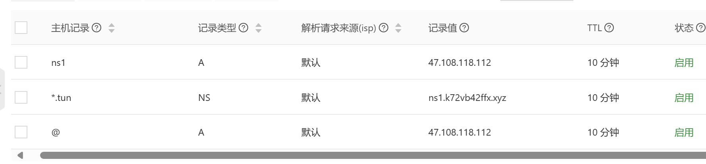
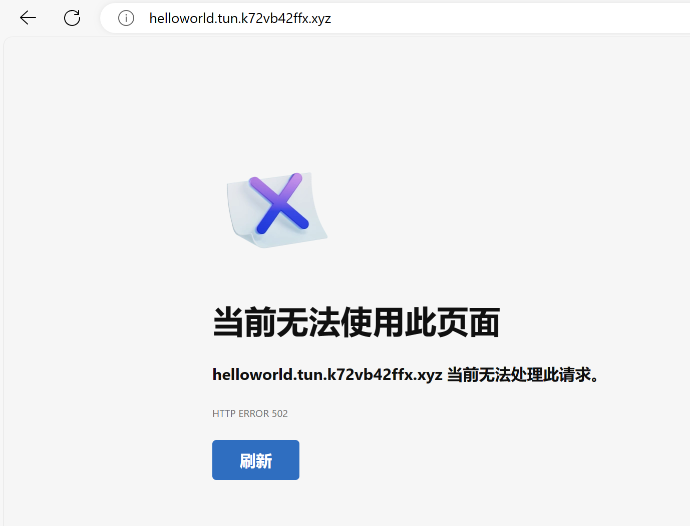
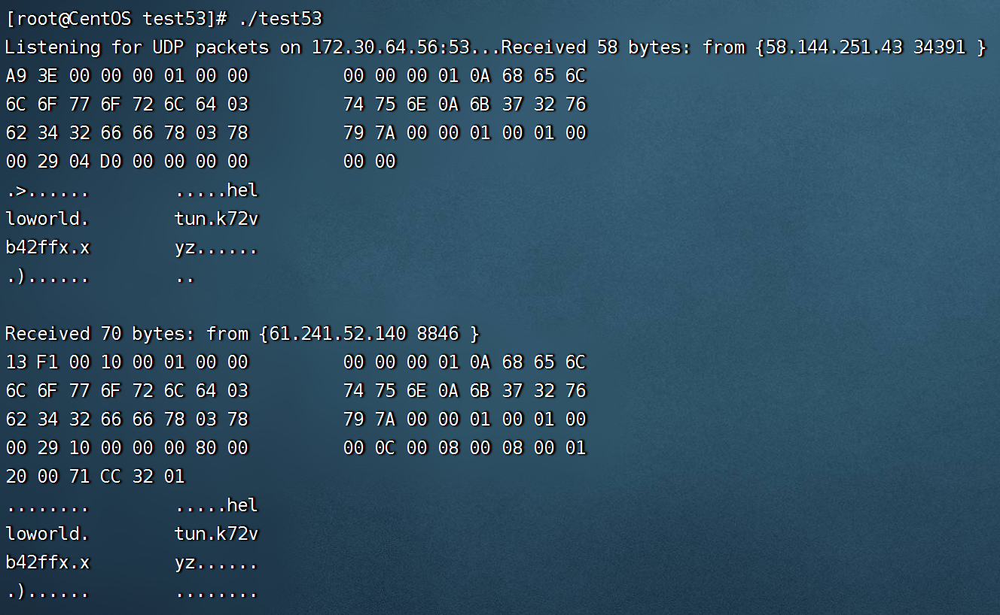

## Dns隧道原理

**原理概述：**

DNS隧道利用DNS协议进行数据传输，绕过防火墙等网络限制，实现隐蔽通信。

**工作流程：**

1. **数据封装：**

   - 将要传输的数据（如命令、控制信息等）封装在DNS请求报文中，通常利用TXT记录类型。
   - 使用域名、子域名、TXT记录等字段进行编码，隐藏实际数据。

2. **DNS查询：**

   - 被控端向DNS服务器发送伪造的DNS查询请求，包含封装好的数据。
   - 查询指定域名，例如 `abc123.example.com`。

3. **数据转发：**

   - 攻击者控制的DNS服务器解析请求，并根据解析结果进行转发：
     - 如果攻击者控制了目标服务器，则直接将数据转发给目标服务器。
     - 否则，将数据转发给中间服务器，再由中间服务器转发给目标服务器。

4. **数据提取：**

   - 目标服务器或中间服务器解析DNS响应报文，提取封装的数据。
   - 根据编码规则解析出实际数据，执行相应操作。

5. #### **演示:**

这里的域名解析设置显示，任何对`tun.k72vb42ffx.xyz`子域名的dns请求都会转发到`ns1.k72vb42ffx.xyz`,即我们自己搭建的dns服务器上。我们可以构造一个特殊的dns查询，实现与服务器通信。

例如,我们想发送helloworld，就可以在浏览器上输入`helloworld.tun.k72vb42ffx.xyz`，这个dns请求便会被转发到我们的服务器上

在这里我编写了一个简单的程序，可以在53号UDP端口上监听数据包，并打印出来。可以看到，服务器成功收到了包装有`helloworld`的dns请求。服务器则可以将响应数据编码后写入到Answers , Additional区域的Data字段里面，实现与客户端通信。